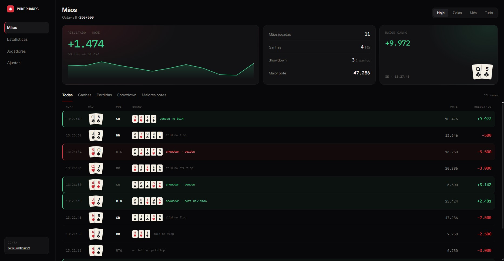
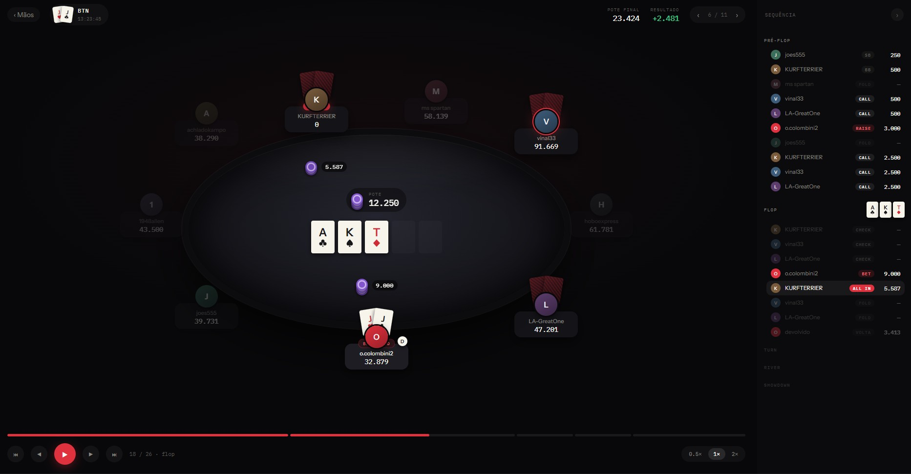

<div align="center">

# PokerHands

**Revise e estude suas mãos do PokerStars.**

Seu histórico de mãos é um arquivo de texto cru.
Isto transforma ele em algo que dá pra olhar.

</div>

<br>



<br>

---

## O problema

Toda mão que você joga vira algo assim no seu disco:

```
PokerStars Hand #261727989562: Hold'em No Limit (250/500)
Seat 3: o.colombini2 (44879 in chips)
o.colombini2: raises 2500 to 3000
*** FLOP *** [Ac Ks Td]
KURFTERRIER: calls 5587 and is all-in
```

Tecnicamente é tudo que aconteceu. Na prática, ninguém revisa cem mãos assim.

---

## O que este app faz

<table>
<tr>
<td width="50%" valign="top">

### Lista

Todas as suas mãos numa tela só, com o que importa de relance: suas cartas, sua posição, o board, o quanto entrou ou saiu.

Verde ganhou, vermelho perdeu, cinza foldou. Dá pra varrer a sessão inteira sem ler uma linha de texto.

</td>
<td width="50%" valign="top">

### Replay

A mesa reconstruída, ação por ação, no ritmo em que a mão realmente aconteceu.

Fold passa rápido. All-in respira. O flop tem o tempo que o flop merece.

</td>
</tr>
</table>

<br>



<br>

---

## O que dá pra fazer

|  |  |
|---|---|
| **Filtrar** | Só as ganhas, só as perdidas, só as que foram a showdown, ou as de maior pote |
| **Recortar por período** | Hoje, últimos 7 dias, mês, ou tudo |
| **Ver o resultado da sessão** | Quanto você fez no recorte, quantas mãos, quantos showdowns, e a curva da sua banca |
| **Revisar sem mouse** | Espaço toca, setas andam, `1`–`4` pulam entre as streets, `Esc` volta pra lista |
| **Ver o que o vilão tinha** | Inclusive as mãos que ele mucou e você nunca chegou a ver na hora |

---

## Rodando

Um atalho na área de trabalho. Sem terminal, sem comando.

```
pokerhands.bat
```

Abre numa janela própria, sem barra de endereço nem abas — dá pra deixar do lado do cliente do PokerStars enquanto joga.

> **Requisito:** o app lê os arquivos direto do disco, então precisa rodar na mesma máquina onde você joga.

---

## Privacidade

Nada sai da sua máquina. Não existe servidor, não existe conta, não existe upload. O app lê a pasta do PokerStars no seu disco e mostra na sua tela — só isso.

---

<div align="center">
<sub>Projeto pessoal. Cash game, No Limit Hold'em.</sub>
</div>